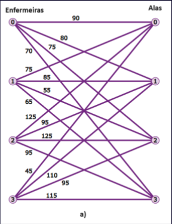

# Designação de Trabalhadores em um Hospital

Imagine que você é o gerente de TI de um grande hospital e está
encarregado de designar uma equipe de enfermeiros para diferentes alas do
hospital, como Emergência, UTI, Pediatria e Cirurgia. Cada enfermeiro tem
diferentes níveis de habilidade e experiência, tornando-o mais ou menos adequado
para trabalhar em determinadas alas. Além disso, alguns enfermeiros podem já estar
familiarizados com as operações de certas alas, o que pode reduzir o tempo de
treinamento e, portanto, os custos.
É possível visualizar esse problema no gráfico abaixo Figura a), em que há
quatro enfermeiros (as) e quatro alas. As linhas conectando os pontos representam
todas as maneiras possíveis de atribuir enfermeiros (as) às alas, enquanto os rótulos
são os custos de atribuir enfermeiros(as) às alas.

Na Figura abaixo temos uma possível atribuição de enfermeiros(as) a alas, em que o
custo total da atribuição será (0 a 3) 70 + (1 a 2) 55 + (2 a 1) 95 + (3 a 0) 45 =
265.:




# Como construir
```bash
make
# O binário está disponível em build/main{.exe}
```

# Conhecimentos utilizados
### Dia 4 - Ponteiros, compiladores
### Dia 5 - Structs, Unions, ponteiro pra função e outros transformers
### Dia 6 - Pré-processadores e macros